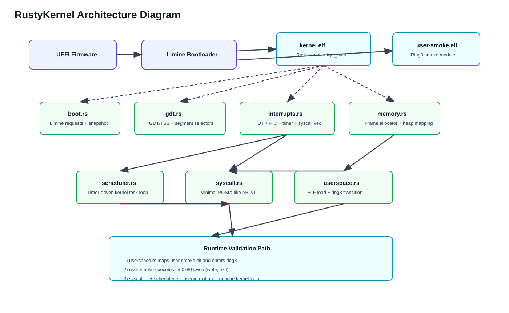
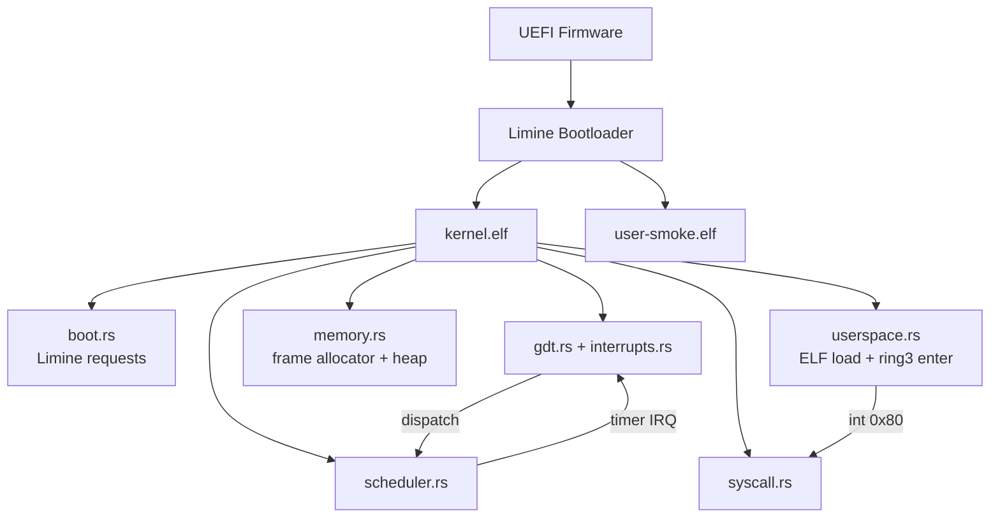
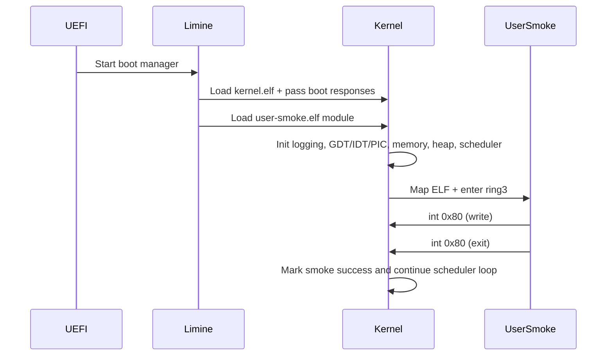

# RustyKernel Graphs

## Architecture Picture

## High-Level Architecture

```mermaid
flowchart TD
    FW[UEFI Firmware] --> LIM[Limine Bootloader]
    LIM --> KERNEL[kernel.elf]
    LIM --> MOD[user-smoke.elf]

    KERNEL --> BOOT[boot.rs\nLimine requests]
    KERNEL --> ARCH[gdt.rs + interrupts.rs]
    KERNEL --> MEM[memory.rs\nframe allocator + heap]
    KERNEL --> SCHED[scheduler.rs]
    KERNEL --> SYSCALL[syscall.rs]
    KERNEL --> USER[userspace.rs\nELF load + ring3 enter]

    USER -->|int 0x80| SYSCALL
    SCHED -->|timer IRQ| ARCH
    ARCH -->|dispatch| SCHED
```

## Boot and Smoke Validation Sequence

```mermaid
sequenceDiagram
    participant UEFI
    participant Limine
    participant Kernel
    participant UserSmoke

    UEFI->>Limine: Start boot manager
    Limine->>Kernel: Load kernel.elf + pass boot responses
    Limine->>Kernel: Load user-smoke.elf module
    Kernel->>Kernel: Init logging, GDT/IDT/PIC, memory, heap, scheduler
    Kernel->>UserSmoke: Map ELF + enter ring3
    UserSmoke->>Kernel: int 0x80 (write)
    UserSmoke->>Kernel: int 0x80 (exit)
    Kernel->>Kernel: Mark smoke success and continue scheduler loop
```
